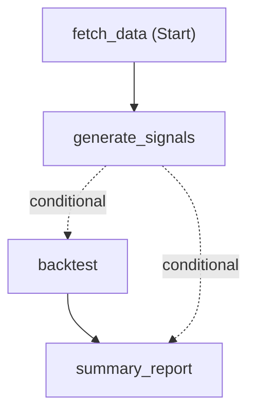

# Quantitative Investment Agent - Microsoft Agent Framework

**Multi-agent quantitative investment analysis system**  

- Built with [Microsoft Agent Framework](https://github.com/microsoft/agent-framework) (Semantic Kernel + AutoGen), featuring a workflow inspired by [Pregel](https://research.google/pubs/pub37252/).  
- Legacy version built with AutoGen (See the [README.md](./legacy_autogen/README.md) under `legacy_autogen`)

## 📖 Overview

An automated trading analysis system that:
- Fetches stock data from Yahoo Finance
- Generates technical trading signals (MACD, RSI, etc.)
- Backtests strategies with performance metrics (CAGR, MDD, Sharpe Ratio)
- Uses workflow-based orchestration for agent coordination

Architecture: Workflow-based with executors, function tools, and type-safe schemas.

## 🚀 Quick Start

```bash
# 1. Install dependencies
uv sync
# Or if using poetry: poetry install

# 2. Set up environment variables
cp .env.example .env
# Edit .env and add your Azure OpenAI credentials

# 3. Run the workflow
python main.py
```

## Samples

See the genereted files under `output`.

- Input sample
```
Analyze Apple (AAPL) stock using a momentum trading strategy:
1. Fetch historical data from 2023-01-01 to 2024-01-01
2. Generate buy/sell signals using MACD and RSI indicators
3. Backtest the strategy with initial capital of $10,000
4. Report performance metrics (CAGR, total return, final value)
```

- Output sample
```
===== Final Output =====
Summary report — backtest outcome

Key results
- Final portfolio value: $11,157.97
- Total return: 11.58% (profit $1,157.97 on implied $10,000 start)
- CAGR: 11.68% (close to total return → consistent with ~1-year test horizon)
- Result files: backtest_results.xlsx / backtest_metrics.txt

Quick interpretation
- The strategy produced a positive return (~11.6%) on the test period with a final value of $11.16k.
- The near-equality of CAGR and total return indicates the backtest covers roughly one year (or that returns were concentrated in a short single-period test).
- The absolute profit ($1,157.97) is modest but meaningful for a single-year horizon; risk-adjusted conclusions require volatility and drawdown data (not included here).
```

## 🏗️ Architecture

### Data-Flow Workflow Pattern

```
┌─────────────┐     ┌──────────────┐     ┌────────────┐     ┌─────────────┐
│ Fetch Data  │────▶│ Generate     │────▶│ Backtest   │────▶│ Summary     │
│ Executor    │     │ Signals      │     │ Executor   │     │ Report      │
│             │     │ Executor     │     │            │     │ Executor    │
└─────────────┘     └──────┬───────┘     └────────────┘     └─────────────┘
                           │
                           │ (if signals fail)
                           │
                           └─────────────────────────────────▶ Summary Report
```

**Key Components**:
- **Executors**: Workflow building blocks (agents with tools)
- **Edges**: Data flow connections with conditional routing
- **WorkflowBuilder**: Constructs the data-flow graph
- **Function Tools**: `agent_tools.py`



## 📁 Project Structure

```
autogen-quant-invest-agent/
├── main.py                  # Entry point
├── agent_workflow.py        # Workflow orchestration
├── agent_quant.py           # Agent definitions
├── agent_tools.py           # Function tools
├── constants.py             # Configuration
├── requirements.txt         # Dependencies
├── output/                  # Generated files
│   ├── stock_data.csv
│   ├── stock_signals.csv
│   ├── backtest_results.xlsx
│   └── backtest_metrics.txt
└── legacy_autogen/          # Original AutoGen implementation
```

## 🔑 Key Differences from AutoGen

| Aspect | Legacy AutoGen | Microsoft Agent Framework |
|--------|---------------|--------------------------|
| **Orchestration** | `GroupChat` + `select_speaker` | `WorkflowBuilder` + edges |
| **Message Flow** | Broadcast to all agents | Data flows through edges |
| **Agents** | `AssistantAgent`, `ConversableAgent` | `ChatAgent` (stateless) |
| **Tools** | `FunctionTool` class | `@ai_function` decorator |
| **State** | Built into agents | `AgentThread` for context |
| **Pattern** | Control-flow (event-driven) | Data-flow (workflow-based) |
| **Routing** | Custom logic in manager | Conditional edges |

## 📊 System Architecture Comparison

### Legacy AutoGen Architecture

```
┌─────────────────────────────────────────────────────────────────┐
│                         User Input                               │
└────────────────────────┬────────────────────────────────────────┘
                         │
                         ▼
┌─────────────────────────────────────────────────────────────────┐
│                    UserProxyAgent                                │
│  (Manual chat initiation, message routing)                      │
└────────────────────────┬────────────────────────────────────────┘
                         │
                         ▼
┌─────────────────────────────────────────────────────────────────┐
│                  GroupChatManager                                │
│  • Custom speaker selection function                            │
│  • Complex transition rules                                     │
│  • File system checks for routing                              │
│  • max_round=10, max_retries=5                                 │
└────────────┬───────────┬────────────┬──────────────────────────┘
             │           │            │
    ┌────────┘           │            └────────┐
    ▼                    ▼                     ▼
┌──────────────┐  ┌──────────────┐  ┌──────────────────────┐
│ Stock        │  │ Signal       │  │ UserProxy            │
│ Analysis     │  │ Analysis     │  │ (Code Executor)      │
│ Agent        │  │ Agent        │  │                      │
└──────┬───────┘  └──────┬───────┘  └──────┬───────────────┘
       │                 │                 │
       ▼                 ▼                 ▼
┌──────────────┐  ┌──────────────┐  ┌──────────────────────┐
│ Tool         │  │ Tool         │  │ Code Execution       │
│ Registry     │  │ Registry     │  │ Environment          │
└──────────────┘  └──────────────┘  └──────────────────────┘
       │                 │                 │
       └─────────────────┴─────────────────┘
                         │
                         ▼
┌─────────────────────────────────────────────────────────────────┐
│              Manual Result Collection                            │
│  • Check file existence                                         │
│  • Parse chat messages                                          │
│  • Extract error messages                                       │
│  • Manual retry logic                                           │
└─────────────────────────────────────────────────────────────────┘
```

### Microsoft Agent Framework Architecture

```
┌─────────────────────────────────────────────────────────────────┐
│                      User Input                                  │
└────────────────────────┬────────────────────────────────────────┘
                         │
                         ▼
┌─────────────────────────────────────────────────────────────────┐
│                QuantInvestWorkflow                               │
│  • Load configuration                                           │
│  • Create agents with tools                                     │
│  • Build workflow with edges                                    │
└────────────────────────┬────────────────────────────────────────┘
                         │
                         ▼
┌─────────────────────────────────────────────────────────────────┐
│                  WorkflowBuilder                                 │
│  workflow = WorkflowBuilder()                                   │
│    .add_edge(fetch, signal)                                     │
│    .add_edge(signal, backtest, condition=file_exists)           │
│    .add_edge(backtest, summary)                                 │
│    .add_edge(signal, summary, condition=file_not_exists)        │
│    .build()                                                     │
└────────────────────────┬────────────────────────────────────────┘
                         │
                         ▼
     ┌──────────────────────────────────────────────────┐
     │            Type-Safe Workflow Pipeline            │
     │                                                   │
     │  ┌─────────────────────────────────────────────┐ │
     │  │ 1. Stock Data Agent                         │ │
     │  │    • Tool: fetch_stock_data                 │ │
     │  │    • Output: stock_data.csv                 │ │
     │  └─────────────────┬───────────────────────────┘ │
     │                    │                             │
     │                    ▼                             │
     │  ┌─────────────────────────────────────────────┐ │
     │  │ 2. Signal Generation Agent                  │ │
     │  │    • Tool: execute_python_code              │ │
     │  │    • Output: stock_signals.csv              │ │
     │  └─────────────────┬───────────────────────────┘ │
     │                    │                             │
     │              ┌─────┴─────┐                       │
     │              │ Conditional│                       │
     │              │   Branch   │                       │
     │              └─────┬─────┘                       │
     │                    │                             │
     │         ┌──────────┴──────────┐                 │
     │         ▼                     ▼                 │
     │  ┌──────────────┐   ┌──────────────────────┐   │
     │  │ 3. Backtest  │   │ 4. Summary (Skip)    │   │
     │  │    Agent     │   │    Report Agent      │   │
     │  │              │   │                      │   │
     │  └──────┬───────┘   └──────────────────────┘   │
     │         │                                       │
     │         ▼                                       │
     │  ┌─────────────────────────────────────────────┐ │
     │  │ 4. Summary Report Agent                     │ │
     │  │    • Aggregates results                     │ │
     │  │    • Final output                           │ │
     │  └─────────────────────────────────────────────┘ │
     │                                                   │
     └───────────────────────────────────────────────────┘
```

**Key Improvements**:
- ✅ **Automatic routing** via conditional edges
- ✅ **Built-in error handling** via WorkflowOutputEvent, ExecutorCompletedEvent
- ✅ **Type safety** with Pydantic models (AgentCompletedResult)
- ✅ **Streaming support** via Workflow.run_stream
- ✅ **State management** via WorkflowContext
- ✅ **Visualization** via WorkflowViz (generates Mermaid diagrams)

## 📚 Resources

- Official documentation: [Overview](https://learn.microsoft.com/en-us/agent-framework/user-guide/workflows/overview) | [Tutorials](https://learn.microsoft.com/en-us/agent-framework/tutorials/overview) |  [Migration from-autogen](https://learn.microsoft.com/en-us/agent-framework/migration-guide/)
- Official GitHub repository: [Microsoft Agent Framework](https://github.com/microsoft/agent-framework)

## 📝 License

MIT