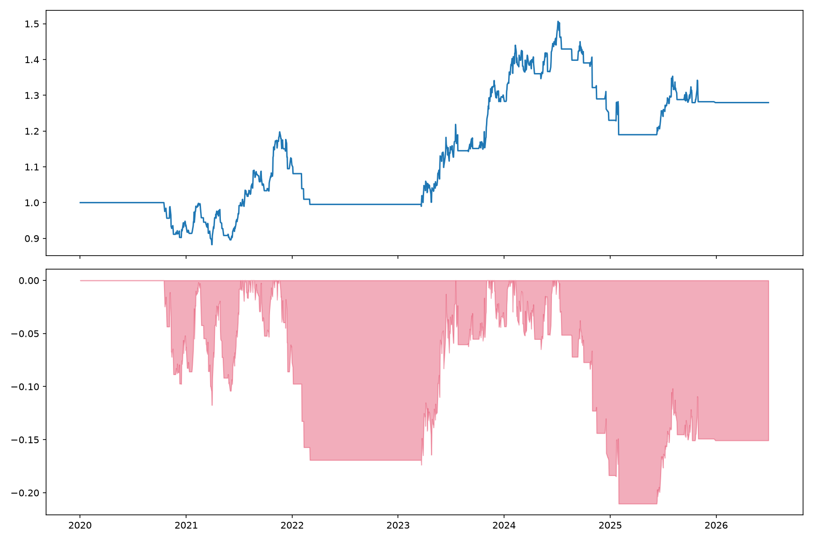

<div align="center">

**Repository overview** &nbsp;|&nbsp; [Agent Framework](docs/agent_framework.md) &nbsp;|&nbsp; [Semantic Kernel](docs/semantic_kernel.md) &nbsp;|&nbsp; [AutoGen reference](docs/autogen.md) &nbsp;|&nbsp; [Agent Framework patterns](docs/agent_framework_patterns.md) &nbsp;|&nbsp; [Framework comparison](docs/autogen_agent_sk.md)

</div>

---

# 💸 Investment Agent Patterns

This project shows how to use Microsoft Agent Framework for stock-market research. Agents download past prices, write and execute a technical-analysis signal script, test the resulting strategy, and save the results.

> [!NOTE]  
> Recommended first: Microsoft Agent Framework. It combines ideas from AutoGen and Semantic Kernel.  
> Semantic Kernel and AutoGen are included only for comparison.

## What's included

| Area | Purpose | Use |
|---|---|---|
| [Agent Framework workflow](docs/agent_framework.md) | Main workflow. | **Start here.** |
| [Semantic Kernel workflow](docs/semantic_kernel.md) | Same steps, plugin-based. | Compare with the main workflow. |
| [AutoGen reference](docs/autogen.md) | Earlier group-chat version. | Compare implementation styles. |
| [Agent Framework patterns](docs/agent_framework_patterns.md) | Examples for the investment domain. | Explore features one at a time. |
| [Framework comparison](docs/autogen_agent_sk.md) | Short comparison of the three frameworks. | - |

The [Agent Framework patterns](docs/agent_framework_patterns.md) are the only pattern showcase in this repository. The 30 examples show Microsoft Agent Framework features for investment research. Semantic Kernel and AutoGen do not have separate pattern libraries here.

## Quick start: Microsoft Agent Framework

Python 3.13 and `uv`. To run the main Agent Framework example, you also need an Azure AI Foundry project with a chat model and access through the Azure CLI.

```bash
uv sync
cp .env.example .env   # set Azure AI Foundry endpoint and model deployment
az login                # authenticate the Azure CLI credential used by the workflow
uv run python -m agent_framework.main
```

On PowerShell, use `Copy-Item .env.example .env` to copy the settings file. Then fill in these values in `.env`:

| Variable | Purpose |
|---|---|
| `AZURE_AI_PROJECT_ENDPOINT` | Address of the Azure AI Foundry project used by the main workflow. |
| `AZURE_AI_MODEL_DEPLOYMENT_NAME` | Name of the chat model deployed in that project. |
| `AZURE_OPENAI_ENDPOINT` | Optional direct Azure OpenAI endpoint for the Semantic Kernel workflow; otherwise it uses the Foundry project endpoint. |
| `AZURE_OPENAI_CHAT_DEPLOYMENT_NAME` | Optional direct Azure OpenAI deployment for the Semantic Kernel workflow. |
| `INVESTMENT_TICKER` | Stock symbol to study. The default is `MSFT`. |
| `INVESTMENT_START_DATE`, `INVESTMENT_END_DATE` | First and last dates for the past-price data. |
| `INVESTMENT_INITIAL_CAPITAL` | Pretend starting amount for the backtest. |

## Optional: Semantic Kernel variant

Use this command only when comparing the plugin-based agent variant. It reuses the configured Foundry project and model by default, then creates charts, metrics, spreadsheets, CSVs, and the generated signal script in its own output folder:

```bash
uv run python -m semantic_kernel.main
```

## Sample research output

The following Agent Framework sample uses `MSFT` from 2020-01-01 through 2026-07-01 with a simulated $10,000 starting balance. It is historical research only; a later run can generate a different strategy and result.

### Input

```text
Analyze MSFT from 2020-01-01 to 2026-07-01. Develop one transparent technical-analysis signal strategy as Python code, execute it, backtest $10000, and report CAGR, total return, final value, drawdown, and Sharpe ratio.
```

### Generated signal

The sample agent generated a long-only trend-and-momentum signal using MSFT closing prices:

- **Buy:** the 50-day simple moving average is above the 200-day simple moving average and RSI(14) is above 50, after that combined condition was previously false.
- **Sell:** the combined condition becomes false: the 50-day average is at or below the 200-day average, or RSI(14) is at or below 50.
- **Hold:** no change in the combined condition.
- **Execution convention:** a close-based condition affects the next session's return, reducing same-close look-ahead bias.

### Performance plot

The top panel shows cumulative strategy returns. The lower panel shows portfolio drawdown from its previous peak.



### Backtest metrics

| Metric | Sample value |
|---|---:|
| [Cumulative return](output/agent_framework/backtest_metrics.txt) | 27.96% |
| CAGR | 3.88% |
| Maximum drawdown | -21.03% |
| Sharpe ratio | 0.36 |
| Final value | $12,796.05 |

See the full [backtest workbook](output/agent_framework/backtest_results.xlsx), [generated signal script](output/agent_framework/generated_signal_strategy.py), and [validated signals](output/agent_framework/stock_signals.csv).

## Repository layout

| Path | Contents |
|---|---|
| [agent_framework](agent_framework) | The main Microsoft Agent Framework application. |
| [semantic_kernel](semantic_kernel) | The Semantic Kernel version of the research workflow. |
| [autogen](autogen) | The AutoGen reference version, with its own Poetry environment. |
| [agent_framework_patterns](agent_framework_patterns) | Thirty small Agent Framework examples for investment research. |
| [tests](tests) | Offline tests for Agent Framework patterns and the REPL contracts. |
| [output](output) | Saved charts, metrics, and example pattern responses. |
| [docs](docs) | Guides for each implementation and framework comparison. |

## Validation

The Agent Framework pattern tests run without Azure credentials or live market-data services:

```bash
uv run ruff check agent_framework semantic_kernel agent_framework_patterns tests
uv run pytest tests -q
```

## Safety and limitations

- These results are for learning and research, not financial advice or a real trading system.
- Both workflows execute model-authored Python to create signals. Their validation is not a security sandbox; run them only in an isolated development environment without credentials or production data.
- Good results from the past do not mean the same strategy will work in the future.
- The examples use public market data and simple rules. They leave out trading fees, price changes that happen while a trade is being made, taxes, careful handling of stock splits and dividends, and checks for an individual investor's needs.
- Review AI responses, connected tools, and data licences before using this project outside a learning or research setting.

## 📝 License

MIT
