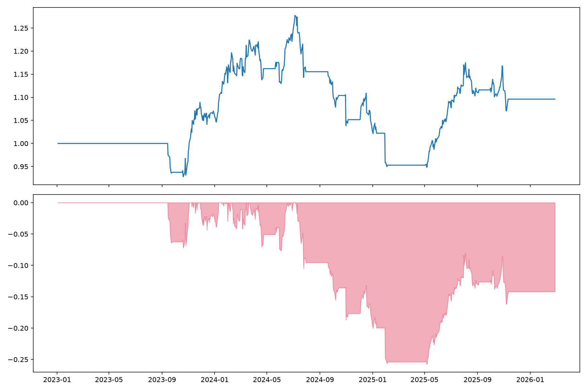

<div align="center">

**Repository overview** &nbsp;|&nbsp; [Agent Framework](docs/agent_framework.md) &nbsp;|&nbsp; [Semantic Kernel](docs/semantic_kernel.md) &nbsp;|&nbsp; [AutoGen reference](docs/autogen.md) &nbsp;|&nbsp; [Agent Framework patterns](docs/agent_framework_patterns.md) &nbsp;|&nbsp; [Framework comparison](docs/autogen_agent_sk.md)

</div>

---

# 💸 Quantitative Investment Agent

This project primarily shows how to use Microsoft Agent Framework for stock-market research. Its main workflow downloads past stock prices, creates trading signals, tests simple strategies against past data, and saves the results.

Microsoft Agent Framework is prioritized because it is the newer unified framework that combines AutoGen's multi-agent approach with Semantic Kernel's application and workflow features.

Semantic Kernel and AutoGen versions are included only to compare different implementation styles. These are learning examples, not a trading app: they cannot connect to a broker, buy or sell stocks, or give personal investment advice.

## What's included

| Area | Purpose | Recommended use |
|---|---|---|
| [Agent Framework workflow](docs/agent_framework.md) | The primary workflow, where several AI agents work through research steps in order. | **Start here.** |
| [Semantic Kernel workflow](docs/semantic_kernel.md) | An optional Semantic Kernel variant of the primary workflow. It follows the same research steps and creates the same set of output files. | Compare the plugin-based implementation. |
| [AutoGen reference](docs/autogen.md) | An earlier group-chat style implementation. | Compare different ways to build agent applications. |
| [Agent Framework patterns](docs/agent_framework_patterns.md) | A comprehensive set of small, standalone examples that show Microsoft Agent Framework features through investment-research scenarios. | Explore capabilities one at a time. |
| [Framework comparison](docs/autogen_agent_sk.md) | A plain comparison of the three frameworks in this project. | Decide which implementation to study. |

The [Agent Framework patterns](docs/agent_framework_patterns.md) are the only pattern showcase in this repository. The 30 examples use Microsoft Agent Framework directly to show what it can do for investment research: create agents, give them tools, let several agents work together, connect to other tools with MCP (a standard way to connect AI to external tools), search documents, check answer quality, track activity, retry failed work, save conversations, and pause for a person to review a step. Semantic Kernel and AutoGen do not have separate pattern libraries here.

## Quick start: Microsoft Agent Framework

You need Python 3.13 and `uv`. To run the main Agent Framework example, you also need an Azure AI Foundry project with a chat model and access through the Azure CLI.

```bash
uv sync
cp .env.example .env   # set Azure AI Foundry endpoint and model deployment
az login                # authenticate the Azure CLI credential used by the workflow
uv run python -m agent_framework.main
```

On PowerShell, use `Copy-Item .env.example .env` to copy the settings file. Then fill in these values in `.env`:

| Variable | Purpose |
|---|---|
| `AZURE_AI_PROJECT_ENDPOINT` | Address of the Azure AI Foundry project used by the main workflow. |
| `AZURE_AI_MODEL_DEPLOYMENT_NAME` | Name of the chat model deployed in that project. |
| `INVESTMENT_TICKER` | Stock symbol to study. The default is `MSFT`. |
| `INVESTMENT_START_DATE`, `INVESTMENT_END_DATE` | First and last dates for the past-price data. |
| `INVESTMENT_INITIAL_CAPITAL` | Pretend starting amount for the backtest. |

## Optional: Semantic Kernel variant

Use this command only when comparing the plugin-based variant. It creates the same type of charts, metrics, spreadsheets, and CSV files as the primary Agent Framework workflow, in its own output folder:

```bash
uv run python -m semantic_kernel.main
```

## Sample research output

These files were created by the main Agent Framework workflow for `MSFT`, using the default date range and a pretend $10,000 starting balance. They are examples only. Results can change when the workflow is run again because market data changes.

### Input query

```text
Analyze MSFT from 2020-01-01 to 2026-07-01; generate MACD/RSI signals, backtest $10000, and report CAGR, total return, final value, drawdown, and Sharpe ratio.
```

### Performance graph

The top line shows how the pretend portfolio value changed over time. The shaded lower chart shows drawdown: how far the portfolio fell from its highest value at each point.



### Backtest metrics

| Strategy | Cumulative return | CAGR | Maximum drawdown | Sharpe ratio | Final value |
|---|---:|---:|---:|---:|---:|
| [MACD and RSI momentum](output/agent_framework/macd_rsi_momentum/backtest_metrics.txt) | -2.82% | -0.91% | -26.51% | 0.02 | $9,717.67 |
| [Moving-average trend](output/agent_framework/movingaverage_trend/backtest_metrics.txt) | -2.00% | -0.64% | -28.29% | 0.02 | $9,799.54 |
| [TRIX and Ultimate Oscillator reversal](output/agent_framework/trix_ultimateoscillator_reversal/backtest_metrics.txt) | 9.60% | 2.96% | -25.73% | 0.29 | $10,959.96 |

- **Cumulative return** is the total percentage gained or lost over the whole test.
- **CAGR** is the average yearly growth rate.
- **Maximum drawdown** is the largest drop from a previous high point.
- **Sharpe ratio** is one simple measure of return compared with day-to-day ups and downs; it is not a guarantee of quality.

### Summary example

> In this example run, the TRIX and Ultimate Oscillator strategy did better than the other two examples. A pretend $10,000 grew to $10,959.96, a 9.60% total gain. However, the portfolio also fell as much as 25.73% from an earlier high. One past result is not proof that a strategy will work in the future. Test it over other time periods and include trading fees, price changes during trades, and data checks before trusting the result.

## Repository layout

| Path | Contents |
|---|---|
| [agent_framework](agent_framework) | The main Microsoft Agent Framework application. |
| [semantic_kernel](semantic_kernel) | The Semantic Kernel version of the research workflow. |
| [autogen](autogen) | The AutoGen reference version, with its own Poetry environment. |
| [agent_framework_patterns](agent_framework_patterns) | Thirty small Agent Framework examples for investment research. |
| [tests](tests) | Offline tests for the Agent Framework patterns. |
| [output](output) | Saved charts, metrics, and example pattern responses. |
| [docs](docs) | Guides for each implementation and framework comparison. |

## Validation

The Agent Framework pattern tests run without Azure credentials or live market-data services:

```bash
uv run ruff check agent_framework semantic_kernel agent_framework_patterns tests
uv run pytest tests/agent_framework_patterns -q
```

## Safety and limitations

- These results are for learning and research, not financial advice or a real trading system.
- Good results from the past do not mean the same strategy will work in the future.
- The examples use public market data and simple rules. They leave out trading fees, price changes that happen while a trade is being made, taxes, careful handling of stock splits and dividends, and checks for an individual investor's needs.
- Review AI responses, connected tools, and data licences before using this project outside a learning or research setting.

## 📝 License

MIT
