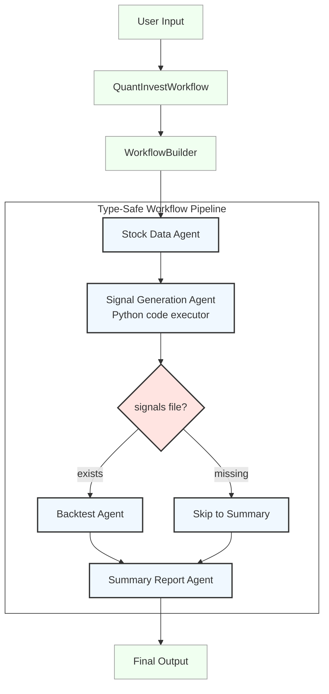
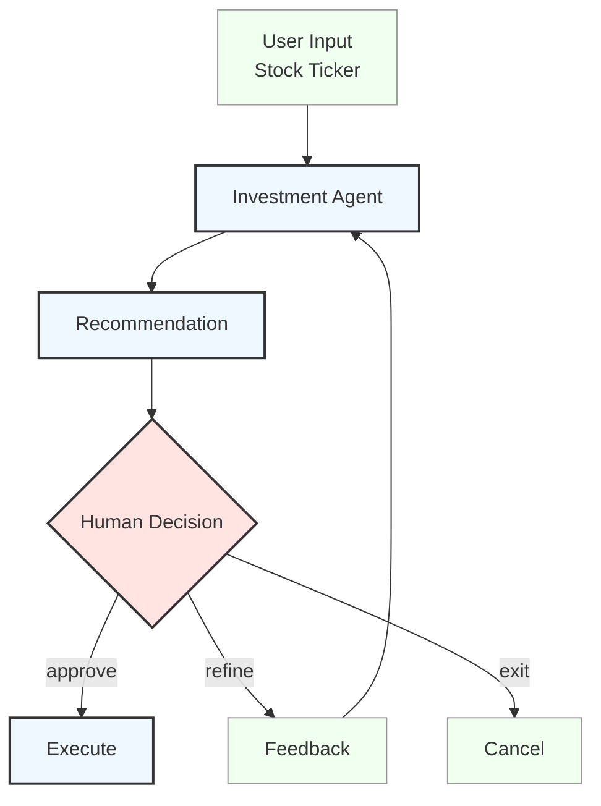
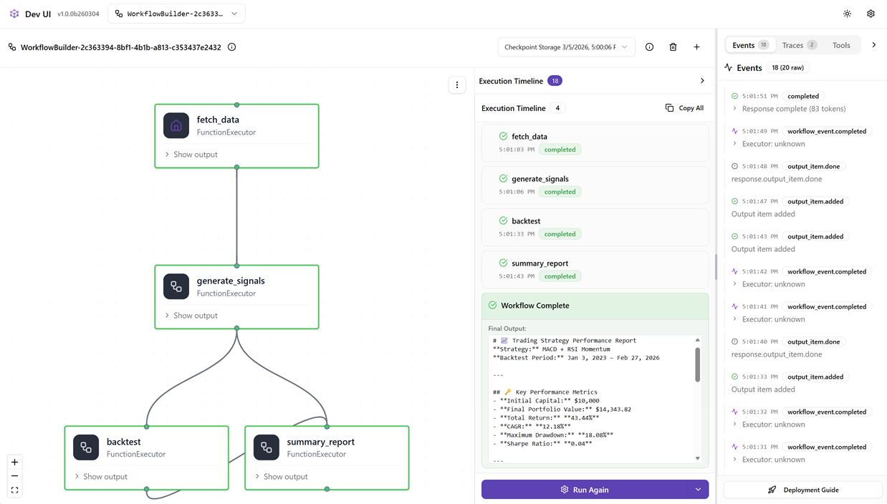

<div align="center">

**[Agent Framework ](README.md)** &nbsp;|&nbsp; [Legacy AutoGen ](legacy_autogen/README.md)

</div>

---

# 💸 Quantitative Investment Agent

Multi-agent quantitative investment analysis system built with [Microsoft Agent Framework](https://github.com/microsoft/agent-framework) (Semantic Kernel + AutoGen), using a [Pregel](https://research.google/pubs/pub37252/)-inspired data-flow workflow.

## 🚀 Quick Start

```bash
uv sync
cp .env.example .env   # add Azure OpenAI credentials
uv run main.py
```

## 📖 Overview

Fetches stock data → generates technical signals (MACD, RSI) → backtests → reports metrics (CAGR, MDD, Sharpe Ratio).

**Sample input**
```
Analyze Apple (AAPL) stock using a momentum trading strategy:
1. Fetch historical data from 2023-01-01 to 2024-01-01
2. Generate buy/sell signals using MACD and RSI indicators
3. Backtest the strategy with initial capital of $10,000
4. Report performance metrics (CAGR, total return, final value)
```

**Sample output**
```
===== Final Output =====
Summary report — backtest outcome

Key results
- Final portfolio value: $11,157.97
- Total return: 11.58% (profit $1,157.97 on implied $10,000 start)
- CAGR: 11.68% (close to total return → consistent with ~1-year test horizon)
- Result files: backtest_results.xlsx / backtest_metrics.txt

Quick interpretation
- The strategy produced a positive return (~11.6%) on the test period with a final value of $11.16k.
- The near-equality of CAGR and total return indicates the backtest covers roughly one year.
- The absolute profit ($1,157.97) is modest but meaningful for a single-year horizon.
```

## 🏗️ Architecture


```mermaid
flowchart TD
    classDef orchestrator fill:#f0fff0,stroke:#999,stroke-width:1px
    classDef agent        fill:#f0f8ff,stroke:#333,stroke-width:2px
    classDef decision     fill:#ffe4e1,stroke:#333,stroke-width:2px

    A[User Input]:::orchestrator --> B[QuantInvestWorkflow]:::orchestrator
    B --> C[WorkflowBuilder]:::orchestrator

    subgraph Pipeline [Type-Safe Workflow Pipeline]
        D[Stock Data Agent]:::agent --> E[Signal Generation Agent<br/>Python code executor]:::agent
        E --> F{signals file?}:::decision
        F -->|exists| G[Backtest Agent]:::agent
        F -->|missing| H[Skip to Summary]:::agent
        G --> I[Summary Report Agent]:::agent
        H --> I
    end
    style Pipeline fill:none,stroke:#333,stroke-width:1px

    C --> D
    I --> J[Final Output]:::orchestrator
```

| Component | Description |
|-----------|-------------|
| **Executors** | Agents with tools — the workflow building blocks |
| **Edges** | Data-flow connections with conditional routing |
| **WorkflowBuilder** | Constructs the directed graph |
| **Tools** | `agents/tools.py` — function tools for each agent |

## 📐 Calculation Assumptions

### CAGR & Returns

- All trading decisions are based on the **previous day's signal** (no look-ahead bias).
- **Buy signal** — daily return = change in Adjusted Close price.
- **Sell signal** — daily return = `(Open / Prev Day Close) − 1` (captures overnight gap).
- **Consecutive identical signals** are treated as **Hold** (no new trade opened).
- A **sell cannot be executed** without a prior buy.

### Signal Validity

| Rule | Behaviour |
|------|-----------|
| No prior buy | Sell signal skipped |
| Duplicate signal | Treated as Hold |
| Partial-year test | CAGR ≈ Total Return (expected) |

## 🧑‍💼 Human-in-the-Loop

`human_in_loop/main_invest_approval.py` — human approval gate before executing investment decisions using `RequestInfoExecutor`.


```mermaid
flowchart TD
    classDef human    fill:#f0fff0,stroke:#999,stroke-width:1px
    classDef agent    fill:#f0f8ff,stroke:#333,stroke-width:2px
    classDef decision fill:#ffe4e1,stroke:#333,stroke-width:2px

    A[User Input<br/>Stock Ticker]:::human --> B[Investment Agent]:::agent
    B --> C[Recommendation]:::agent
    C --> D{Human Decision}:::decision
    D -->|approve| E[Execute]:::agent
    D -->|refine| F[Feedback]:::human
    D -->|exit| G[Cancel]:::human
    F --> B
```

```bash
uv run human_in_loop/main_invest_approval.py
```

## 📊 Dev UI



## 📚 Resources

- Docs: [Overview](https://learn.microsoft.com/en-us/agent-framework/user-guide/workflows/overview) | [Tutorials](https://learn.microsoft.com/en-us/agent-framework/tutorials/overview) | [Migration from AutoGen](https://learn.microsoft.com/en-us/agent-framework/migration-guide/)
- [Microsoft Agent Framework](https://github.com/microsoft/agent-framework) | [Samples](https://github.com/microsoft/Agent-Framework-Samples)

## 📝 License

MIT
