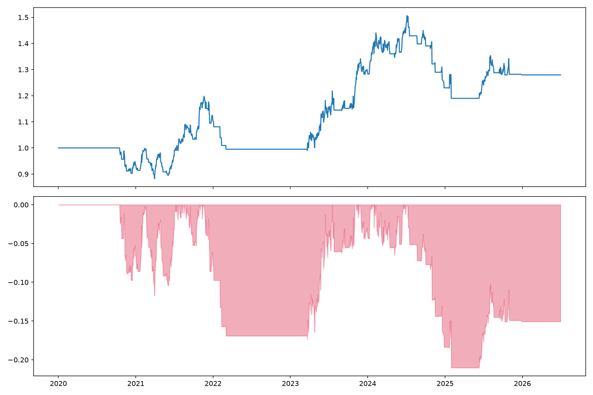

<div align="center">

**Repository overview** &nbsp;|&nbsp; [Agent Framework](docs/agent_framework.md) &nbsp;|&nbsp; [Agent Framework patterns](docs/agent_framework_patterns.md) &nbsp;|&nbsp; [Terminal dashboard](docs/chart_cli.md) &nbsp;|&nbsp; [AutoGen (legacy)](.old/docs/autogen.md) &nbsp;|&nbsp; [Semantic Kernel (legacy)](.old/docs/semantic_kernel.md) &nbsp;|&nbsp; [ETF research (legacy)](docs/etf_research.md) &nbsp;|&nbsp; [Archive guide](docs/archive.md)

</div>

---

# 💸 Investment Agent Patterns

This project shows how to use Microsoft Agent Framework for stock-market research. Agents download past prices, write and execute a technical-analysis signal script, test the resulting strategy, and save the results.

> [!NOTE]  
> Recommended first: Microsoft Agent Framework. It combines ideas from AutoGen and Semantic Kernel.  
> AutoGen, Semantic Kernel, and standalone ETF research have moved to [.old](.old); see the [archive guide](docs/archive.md). The active project contains Microsoft Agent Framework and the terminal UI (TUI).

## Real-time terminal dashboard and backtesting interface

[chart-cli](docs/chart_cli.md) renders a live watchlist, price chart, and Agent Framework workflow output in the terminal. Press `/` for the command prompt: `/ask` answers questions about the symbols on screen, `/backtest` has an agent write and test a strategy from a plain-language request, `/period` sets the window, `/model` switches the chat backend, and `/help` lists everything. In the screenshot below, `AGENT:RULES` means the workflow is using its transparent rule-based path because no chat provider was connected.


Run this from PowerShell:

```powershell
cd chart-cli
pnpm install
.\scripts\test-cli.ps1
```

The script verifies the Node UI and Python Agent Framework protocol, then opens
the interactive dashboard in the same terminal. It starts the workflow process
used by the dashboard; do not start a separate Python backend. Use
`.\scripts\test-cli.ps1 -CheckOnly` for verification without opening the UI.

See the [terminal dashboard guide](docs/chart_cli.md) for the panels, keys, commands, periods, and provider setup.

## What's included

| Area | Purpose | Use |
|---|---|---|
| [Agent Framework workflow](docs/agent_framework.md) | Main workflow. | **Start here.** |
| [Agent Framework patterns](docs/agent_framework_patterns.md) | Examples for the investment domain. | Explore features one at a time. |
| [Real-time terminal dashboard](docs/chart_cli.md) | Live watchlist and charts driven by an Agent Framework workflow, with `/ask`, `/backtest`, `/period`, and `/model` commands. | Watch signals update in a terminal. |
| [AutoGen stock-research agents](.old/docs/autogen.md) | Group-chat agents propose strategies, generate signals, backtest, and report results. | Legacy reference. |
| [Semantic Kernel research workflow](.old/docs/semantic_kernel.md) | Plugin-based agents fetch prices, execute signal code, backtest, and plot results. | Legacy reference. |
| [ETF strategy research tools](docs/etf_research.md) | Standalone scripts explore momentum, volatility targeting, drawdown controls, and benchmarks. | Legacy research. |

The [Agent Framework patterns](docs/agent_framework_patterns.md) are the only pattern showcase in this repository. The 30 examples show Microsoft Agent Framework features for investment research. Semantic Kernel and AutoGen do not have separate pattern libraries here.

## Quick start: Microsoft Agent Framework

Python 3.13 and `uv`. To run the main Agent Framework example, you also need an Azure AI Foundry project with a chat model and access through the Azure CLI.

```bash
uv sync
cp .env.example .env   # set Azure AI Foundry endpoint and model deployment
az login                # authenticate the Azure CLI credential used by the workflow
uv run python -m agent_framework.main
```

On PowerShell, use `Copy-Item .env.example .env` to copy the settings file. Then fill in these values in `.env`:

| Variable | Purpose |
|---|---|
| `AZURE_AI_PROJECT_ENDPOINT` | Address of the Azure AI Foundry project used by the main workflow. |
| `AZURE_AI_MODEL_DEPLOYMENT_NAME` | Name of the chat model deployed in that project. |
| `INVESTMENT_TICKER` | Stock symbol to study. The default is `MSFT`. |
| `INVESTMENT_START_DATE`, `INVESTMENT_END_DATE` | First and last dates for the past-price data. |
| `INVESTMENT_INITIAL_CAPITAL` | Pretend starting amount for the backtest. |

<a id="legacy-code-index"></a>

## Legacy: AutoGen, Semantic Kernel, and ETF research

These earlier implementations and research experiments remain under [.old](.old) for reference, outside the default workflow and test suite. The [archive guide](docs/archive.md) explains their layout and execution.

The archived [ETF research guide](docs/etf_research.md) documents global USD defaults with SPY as the benchmark and QQQ as an option. This selects the benchmark/fallback/regime, not every strategy's universe; historical Korean-market reports are not results of the refactored scripts or comparable to new USD runs.

| Implementation | What it contains | Explore |
|---|---|---|
| AutoGen stock-research agents | Conversational agents for strategy ideas, price analysis, signal generation, backtesting, and report writing. | [Source](.old/autogen) · [Architecture and guide](.old/docs/autogen.md) · [Sample results](.old/output/autogen) |
| Semantic Kernel research workflow | A plugin-based pipeline that fetches prices, writes and executes Python signals, backtests, and produces charts and metrics. | [Source](.old/semantic_kernel) · [Architecture and guide](.old/docs/semantic_kernel.md) · [Sample results](.old/output/semantic_kernel) |
| Standalone ETF strategy experiments | Scripts for momentum strategies, volatility targeting, drawdown and stop-loss analysis, benchmark comparisons, and GenPort factor inspection. | [Guide](docs/etf_research.md) · [Research scripts](.old/tools) · [Archived sample artifacts](.old/output) |
| Cross-framework REPL tests | Checks that Agent Framework and Semantic Kernel validate generated signals and produce matching results for the same script and prices. | [Comparison tests](.old/tests/test_research_repl.py) · [Run instructions](docs/archive.md#legacy-execution) |

See the [framework comparison](.old/docs/autogen_agent_sk.md) for implementation differences and the [relocation map](docs/archive.md#relocation-map) for previous and current paths.

## Sample research output

The following Agent Framework sample uses `MSFT` from 2020-01-01 through 2026-07-01 with a simulated $10,000 starting balance. It is historical research only; a later run can generate a different strategy and result.

### Input

```text
Analyze MSFT from 2020-01-01 to 2026-07-01. Develop one transparent technical-analysis signal strategy as Python code, execute it, backtest $10000, and report CAGR, total return, final value, drawdown, and Sharpe ratio.
```

### Generated signal

The sample agent generated a long-only trend-and-momentum signal using MSFT closing prices:

- **Buy:** the 50-day simple moving average is above the 200-day simple moving average and RSI(14) is above 50, after that combined condition was previously false.
- **Sell:** the combined condition becomes false: the 50-day average is at or below the 200-day average, or RSI(14) is at or below 50.
- **Hold:** no change in the combined condition.
- **Execution convention:** a close-based condition affects the next session's return, reducing same-close look-ahead bias.

### Performance plot

The top panel shows cumulative strategy returns. The lower panel shows portfolio drawdown from its previous peak.



### Backtest metrics

| Metric | Sample value |
|---|---:|
| Cumulative return | 27.96% |
| CAGR | 3.88% |
| Maximum drawdown | -21.03% |
| Sharpe ratio | 0.36 |
| Final value | $12,796.05 |

See the full [backtest workbook](output/agent_framework/backtest_results.xlsx), [generated signal script](output/agent_framework/generated_signal_strategy.py), and [validated signals](output/agent_framework/stock_signals.csv).

Text reports (`*.txt`) and pickle caches (`*.pkl`) are local generated artifacts, not version controlled or included in a clean clone. The sample metrics above remain illustrative; the linked workbook, script, signals, and chart provide the bundled sample artifacts.

## Repository layout

| Path | Contents |
|---|---|
| [agent_framework](agent_framework) | The main Microsoft Agent Framework application. |
| [agent_framework_patterns](agent_framework_patterns) | Thirty small Agent Framework examples for investment research. |
| [chart-cli](chart-cli) | Real-time terminal dashboard with a companion Agent Framework workflow. |
| [tests](tests) | Offline tests for Agent Framework patterns and the REPL contracts. |
| [output](output) | Agent Framework charts, metrics, and example pattern responses. |
| [docs](docs) | Agent Framework, TUI, archive, and ETF research guides, linked from this single README entry point. |
| [.old](.old) | Archived frameworks, comparison tests and independent architecture guides, standalone ETF tools, and non-Agent-Framework sample outputs. See the [archive guide](docs/archive.md). |

## Validation

The Agent Framework pattern tests run without Azure credentials or live market-data services:

```bash
uv run ruff check agent_framework agent_framework_patterns tests
uv run pytest tests -q
```

## Safety and limitations

- These results are for learning and research, not financial advice or a real trading system.
- The research workflows execute model-authored Python to create signals. Their validation is not a security sandbox; run them only in an isolated development environment without credentials or production data.
- Good results from the past do not mean the same strategy will work in the future.
- The examples use public market data and simple rules. They leave out trading fees, price changes that happen while a trade is being made, taxes, careful handling of stock splits and dividends, and checks for an individual investor's needs.
- Review AI responses, connected tools, and data licences before using this project outside a learning or research setting.

## 📝 License

MIT
