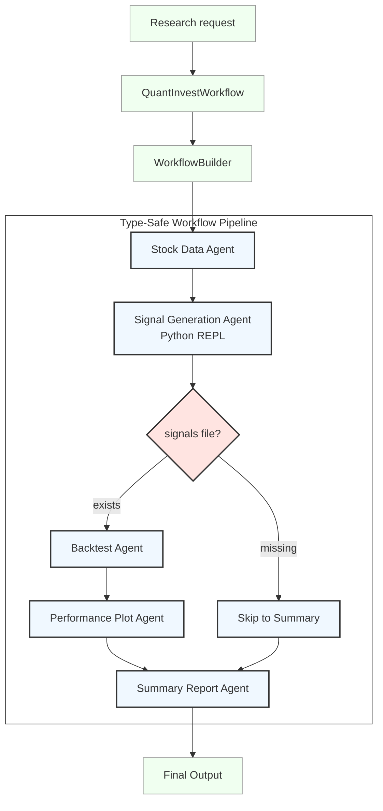

# Microsoft Agent Framework Investment Workflow

[Repository overview](../README.md) &nbsp;|&nbsp; **[Agent Framework](agent_framework.md)** &nbsp;|&nbsp; [Semantic Kernel workflow](semantic_kernel.md) &nbsp;|&nbsp; [AutoGen reference](autogen.md) &nbsp;|&nbsp; [Agent Framework patterns](agent_framework_patterns.md) &nbsp;|&nbsp; [Framework comparison](autogen_agent_sk.md)

## Purpose

The [Agent Framework implementation](../agent_framework) is the repository's primary agent-oriented workflow. It uses Microsoft Agent Framework with Azure AI Foundry to coordinate research-only stock-data retrieval, agent-authored Python signal generation, backtesting, plotting, and a final written summary.

Microsoft Agent Framework is the unified successor to AutoGen and Semantic Kernel. It supplies agents for open-ended, tool-using tasks and graph-based workflows for explicit multi-step orchestration. This implementation uses a workflow because the research pipeline has a defined execution order and a conditional backtesting branch.

> The workflow produces research artifacts only. It does not provide personalised financial advice, connect to a brokerage, or submit orders.

## Architecture



`QuantInvestWorkflow` constructs the graph with `WorkflowBuilder`:

| Stage | Responsibility | Implementation |
|---|---|---|
| Stock data | Retrieves requested OHLCV history. | `stock_data_fetcher` and `AgentTools.fetch_stock_data()` |
| Signals | Designs a hypothesis, writes Python, executes it, and validates the `BuySignal`, `SellSignal`, and `Description` dataset. | `signal_generator` and `AgentTools.run_python_repl()` |
| Conditional route | Continues to backtesting only when the validated signal file exists. | `QuantInvestWorkflow._has_signals()` |
| Backtest | Calculates portfolio metrics and writes result artifacts. | `backtester` and `AgentTools.backtest_strategy()` |
| Plot | Creates the cumulative-return and drawdown chart. | `performance_plotter` and `AgentTools.plot_performance()` |
| Summary | Writes a bounded research summary with assumptions, limitations, and risks. | `summary_reporter` |

The workflow stores checkpoints under [checkpoints](../checkpoints), emits its Mermaid graph to `output/agent_framework/workflow_diagram.mmd` after a run, and writes research artifacts below [output/agent_framework](../output/agent_framework).

## Project modules

| Module | Role |
|---|---|
| [main.py](../agent_framework/main.py) | Loads configuration, creates the workflow, runs a default research request, and optionally launches Dev UI. |
| [workflow.py](../agent_framework/workflow.py) | Defines the Foundry-agent graph and checkpoint integration. |
| [tools.py](../agent_framework/tools.py) | Implements market-data retrieval, REPL execution, backtesting, plots, and output paths. |
| [models.py](../agent_framework/models.py) | Defines Pydantic backtest metrics. |

## Configuration and run

The root project requires Python 3.13. Install dependencies, copy the template, set the Foundry endpoint and model deployment, then authenticate the Azure CLI:

```bash
uv sync
cp .env.example .env
az login
uv run python -m agent_framework.main
```

On PowerShell, use `Copy-Item .env.example .env` to create the configuration file.

| Variable | Default | Purpose |
|---|---|---|
| `AZURE_AI_PROJECT_ENDPOINT` | — | Azure AI Foundry project endpoint. Required. |
| `AZURE_AI_MODEL_DEPLOYMENT_NAME` | — | Azure AI Foundry chat-model deployment. Required. |
| `INVESTMENT_TICKER` | `MSFT` | Ticker symbol for the research request. |
| `INVESTMENT_START_DATE` | `2020-01-01` | Inclusive market-data start date. |
| `INVESTMENT_END_DATE` | `2026-07-01` | Market-data end date passed to the data provider. |
| `INVESTMENT_INITIAL_CAPITAL` | `10000` | Simulated starting capital. |
| `LAUNCH_DEV_UI` | `false` | Set to `true` to serve the workflow in Dev UI on port 8090. |

The application calls `load_dotenv()` itself. Microsoft Agent Framework does not automatically load `.env` files.

## REPL contract and research calculations

The signal agent decides which technical indicators and thresholds to use for each run. It must submit Python to `run_python_repl`, implemented in [research_repl.py](../agent_framework/research_repl.py), which persists the script as `generated_signal_strategy.py` and accepts output only when it has one signal row per price row and the required `BuySignal`, `SellSignal`, and `Description` columns. The REPL exposes pandas, NumPy, and `ta` together with `INPUT_PATH` and `OUTPUT_PATH`; it rejects unrelated imports and common dynamic-execution primitives.

The deterministic backtest itself applies the following simplified rules:

- A position opens on a buy signal only when no position is held, and closes on a sell signal only when a position is held.
- The return for a held position is the following session's Adjusted Close percentage change, avoiding look-ahead bias.
- Duplicate buy or sell signals leave the current position unchanged.
- Metrics include cumulative return, CAGR, maximum drawdown, Sharpe ratio, and final portfolio value.
- The model does not simulate intraday fills, spread, slippage, trading fees, taxes, or corporate-action validation.

## Research artifacts

For the one strategy designed by the agent, the workflow creates:

- `stock_data.csv`
- `stock_signals.csv`
- `backtest_results.xlsx`
- `backtest_metrics.txt`
- `stock_plot.png`

## Human review, patterns, and observability

The primary workflow does not record approvals. For a focused human-review gate, see [workflow-checkpointing.py](../agent_framework_patterns/workflow-checkpointing.py). The standalone pattern library covers agent creation, MCP, RAG, streaming, persistence, retry middleware, structured output, evaluation, observability, and declarative definitions; see [Agent Framework patterns](agent_framework_patterns.md).

Console OpenTelemetry exporters are disabled by default in the observability samples. Set `ENABLE_CONSOLE_OTEL_EXPORTERS=true` only when console traces are needed.

## Operational considerations

- Azure AI Foundry requests use Azure CLI credentials in this implementation; run `az login` before execution.
- The workflow executes model-produced code. The REPL validation constrains its intended data contract but is not a security sandbox. Use it only in an isolated development environment with no credentials or production data; replace it with an approved, sandboxed execution service before production use.
- Use licensed market data and validate data quality, execution assumptions, compliance controls, and human approval requirements before any production deployment.

## Official Documentation

[Official Microsoft Agent Framework documentation](https://learn.microsoft.com/agent-framework/overview/agent-framework-overview) &nbsp;|&nbsp; [Python samples](https://github.com/microsoft/agent-framework/tree/main/python/samples)
