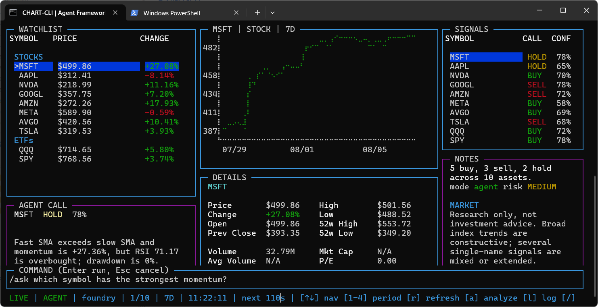

<div align="center">

[Repository overview](../README.md) &nbsp;|&nbsp; [Agent Framework](agent_framework.md) &nbsp;|&nbsp; [Agent Framework patterns](agent_framework_patterns.md) &nbsp;|&nbsp; **[TUI](chart_cli.md)** &nbsp;|&nbsp; [Archive guide](archive.md)

</div>

---

# chart-cli

A real-time terminal dashboard for crypto, equities, and ETFs. Live prices and
charts are rendered with `blessed-contrib`, and every advisory panel, answer,
and backtest is produced by **Microsoft Agent Framework workflows** running as a
companion Python process. The source lives in [chart-cli](../chart-cli); every
command below is run from that directory.

The terminal visualisation layout is derived from the `stonks-dashboard`
checkpoint in its local runtime directory (excluded from version control).



## Panels

| Panel | Contents |
|---|---|
| `WATCHLIST` | Live price and period change per symbol, grouped by asset class, with change flashing. |
| Price trend | Braille line chart for the selected symbol over the active period. |
| `DETAILS` | Quote fields plus workflow indicators (RSI, SMAs, momentum, volatility). |
| `SIGNALS` | Workflow call and confidence for every symbol. |
| `AGENT CALL` | Risk-adjusted call, position cap, rationale, and risk note for the selected symbol. |
| `NOTES` | Portfolio headline, run mode, market note, risk summary, disclaimer. |

## Keys

| Key | Action |
|---|---|
| `↑` / `↓` or `k` / `j` | Move the watchlist selection. |
| `1` – `6` | Switch period: 1D, 7D, 30D, 90D, 1Y, 2Y. |
| `r` | Refresh market data now. |
| `a` | Run the Agent Framework workflow now. |
| `l` | Toggle the log overlay. |
| `/` or `:` | Open the command prompt. |
| `?` | Show help. |
| `q` / `Esc` | Close the open overlay, or quit. |

## Commands

Press `/` or `:` to open the command prompt, type one command, then press
`Enter` (`Esc` cancels).

| Command | Purpose |
|---|---|
| `/ask <question>` | Ask a question about the symbols currently on screen. |
| `/backtest [SYMBOL] [PERIOD] [objective]` | Backtest a symbol from a natural-language strategy request. |
| `/period [1D\|7D\|30D\|90D\|1Y\|2Y]` | Set the window the panels, `/ask`, and the advisory workflow use. |
| `/ticker [add\|remove] <SYMBOL> [coingecko-id]` | List or edit the watchlist. |
| `/model [provider] [args...]` | Inspect or switch the chat backend. |
| `/analyze` | Run the advisory workflow now. |
| `/refresh` | Refresh market data now. |
| `/help` | Show command and key help. |
| `/quit` | Exit chart-cli. |

### `/ask`

`/ask` sends the current snapshot, its indicators, and the question to the
`market_analyst` agent. The agent may only use the displayed market data, so
the active period decides the window it can reason about. Switch it with the
`1` – `6` keys or `/period` before asking.

Sample questions:

```
/ask which symbol has the strongest momentum?
/ask which symbol has the weakest momentum?
/ask is the selected symbol overbought?
/ask how does BTC volatility compare with SPY?
/ask which symbols are trading below their slow SMA?
/ask rank the watchlist by risk-adjusted strength
/ask what changed most over this period, and by how much?
/ask are any symbols showing a fresh SMA crossover?
/ask which symbol has the deepest drawdown from its recent high?
```

Out of scope, and answered as such — the workflow has no news, fundamentals, or
history beyond the snapshot on screen:

```
/ask should I buy NVDA?
/ask what will the Fed do next month?
/ask what is MSFT's P/E versus its five-year average?
```

### `/backtest`

`/backtest` runs its own study, independent of the on-screen period. The
natural-language request is the strategy hypothesis: the Agent Framework
`signal_generator` agent authors Python for the repository's research REPL,
which must return aligned `BuySignal`, `SellSignal`, and `Description` rows
before the engine simulates them. Rejected code is returned to the agent with
the REPL diagnostics, up to three attempts. A chat provider is therefore
required; `/model offline` cannot run a backtest.

The argument after the symbol sets how much daily history is loaded (`30d`,
`6mo`, `1y`, `5y`, `10y`, or `max` for everything the data source has); it
defaults to two years. Progress streams while the simulation walks the series,
and the result shows the request, the generated strategy and its rationale,
return, CAGR, drawdown, Sharpe ratio, win rate, exposure, recent fills, and a
research-only verdict.

```
/backtest                 selected symbol, two years
/backtest MSFT            a named watchlist symbol
/backtest MSFT 5y         five years of daily history
/backtest MSFT max        every bar the data source has
/backtest 6mo avoid overbought entries
/backtest MSFT 5y the 50-day simple moving average is above the 200-day simple moving average and RSI(14) is above 50
```

The period must leave at least 30 valid price bars. Results exclude fees,
slippage, and taxes, and are historical research rather than a trading
recommendation.

### `/period`

`/period` with no argument lists the presets and marks the active one. With a
label it switches the watchlist, chart, `DETAILS`, `/ask`, and the advisory
workflow to that window and refreshes immediately:

```
/period            list the presets
/period 90D        three months
/period 1Y         one year
```

`/backtest` is independent: it always loads its own history so a long study
does not change what is on screen.

### `/ticker`

`/ticker` with no argument lists the watchlist and where each symbol is fetched
from. `add` and `remove` edit it, save `config.json`, and refresh immediately —
no restart:

```
/ticker                     list the watchlist
/ticker add TSLA            equity or ETF, fetched from Yahoo Finance
/ticker add BTC bitcoin     crypto, fetched from CoinGecko by coin id
/ticker remove QQQ          drop a symbol
```

A symbol is treated as crypto only when it has a CoinGecko coin id, so
`/ticker add BTC` alone would look BTC up on Yahoo Finance. Equities use Yahoo
tickers (`BRK-B`, `7203.T`, `VOD.L`). The watchlist cannot be emptied, and a
symbol that returns no quote is flagged in the panel so a typo is obvious.

### `/model`

`/model` with no argument prints the active provider, model, endpoint, and mode.
With arguments it rebuilds every agent on a new backend without restarting the
dashboard:

| Command | Backend |
|---|---|
| `/model foundry [deployment]` | Microsoft Foundry project endpoint with Azure CLI credentials. |
| `/model openai <model> [base-url] [KEY_ENV_VAR]` | Any OpenAI-compatible Chat Completions endpoint with key auth. |
| `/model copilot [model]` | The GitHub Copilot CLI client (`agent-framework-github-copilot`). |
| `/model offline` | Detach the model; panels and `/ask` use the deterministic rule strategy, and `/backtest` is unavailable. |

The key for an OpenAI-compatible endpoint is never typed into the prompt: the
last argument is the *name* of an environment variable (default
`OPENAI_API_KEY`), so no secret reaches the screen, the log overlay, or the
NDJSON protocol. Copilot has no structured-output mode, so its agents receive
the JSON schema in their instructions and the reply is parsed leniently.

## Run

Use the PowerShell launcher rather than starting the Node UI directly:

```powershell
cd chart-cli
pnpm install
.\scripts\test-cli.ps1
```

The script validates the Node UI and the real Python workflow protocol, then
opens the interactive dashboard in the same terminal. The dashboard starts its
own workflow process, so do not start a separate Python backend.

To validate without opening the UI:

```powershell
.\scripts\test-cli.ps1 -CheckOnly
```

To exercise the workflow alone against a synthetic snapshot:

```bash
pnpm run agent
```

## Agent Framework workflow

`signal_agent` is one package per concern:

| Module | Role |
|---|---|
| `models.py` | Pydantic contracts shared by the dashboard and the workflows. |
| `features.py` | Deterministic indicators and the rule-based fallback strategy. |
| `backtest.py` | The engine that simulates the generated signals bar by bar. |
| `providers.py` | Foundry / OpenAI-compatible / Copilot backends and error shortening. |
| `workflow/agents.py` | `AgentTeam`: build agents, call one, raise `AgentFailure`. |
| `workflow/advisory.py`, `workflow/ask.py`, `workflow/backtest.py` | The three graphs. |
| `run_agent.py` | NDJSON server that owns the provider and routes requests. |

The advisory graph is built with `WorkflowBuilder`:

```
extract_features ─(has features)─▶ technical_read ─▶ risk_review ─▶ compose_report
        └───────────(no features)──────────────────────────────────▶ compose_report
```

| Executor | Role |
|---|---|
| `extract_features` | Deterministic pandas/numpy indicators: fast SMA, slow SMA, RSI(14), momentum, annualised volatility, drawdown. |
| `technical_read` | `technical_analyst` agent returning a `TechnicalRead` structured response. |
| `risk_review` | `risk_officer` agent returning a `RiskReview` with position caps and a portfolio risk level. |
| `compose_report` | Merges indicators, signals, and risk adjustments into the `AdvisoryReport` streamed to the dashboard. |

Every agent call goes through `AgentTeam.run()`, which validates the reply
against its schema and raises `AgentFailure` on any error, so each stage has a
single `except` clause that switches to the rule-based path.

The backtest graph is a second `WorkflowBuilder` pipeline:

```
generate_signals ─▶ simulate ─▶ review_backtest
```

| Executor | Role |
|---|---|
| `generate_signals` | `signal_generator` agent writes a strategy script, executed and validated by the shared research REPL. |
| `simulate` | Walks the price series over the validated signals and yields progress frames as it goes. |
| `review_backtest` | `backtest_reviewer` agent turns the strategy and metrics into a verdict; a deterministic reading is used when no agent answers. |

The dashboard keeps one Python process alive in `--serve` mode and exchanges
newline-delimited JSON: a request `{"kind": ..., "payload": ...}` in, one or
more responses out. Responses are prefixed with `@@REPORT@@ ` so ordinary log
output is ignored, and their `kind` field (`advisory`, `ask`, `model`, `frame`,
`summary`) routes them back to the caller.

### Modes

- **`agent`** — a chat provider is connected, either from the environment at
  startup or from `/model`.
- **`offline`** — no provider is configured, or an agent call fails. The
  advisory and `/ask` graphs run with a transparent SMA/RSI crossover strategy
  and volatility-scaled position caps, so the dashboard stays usable; only
  `/backtest` needs a provider, because its strategy is agent-written. The
  status bar shows `AGENT:RULES` and the `NOTES` panel shows `mode offline`.

At startup the provider is chosen from the environment: `CHART_CLI_PROVIDER`
(`foundry`, `openai`, `copilot`, `offline`) with `CHART_CLI_MODEL`,
`CHART_CLI_ENDPOINT`, and `CHART_CLI_API_KEY_VAR`. When it is unset, Foundry is
used if `AZURE_AI_PROJECT_ENDPOINT` and `AZURE_AI_MODEL_DEPLOYMENT_NAME` are
present, otherwise an OpenAI-compatible client if `OPENAI_API_KEY` is set.

## Configuration

`config.json`:

| Key | Meaning |
|---|---|
| `tickers` | Watchlist symbols in display order; edit here or with `/ticker`. |
| `cryptoIds` | Ticker to CoinGecko coin id; a ticker listed here is fetched as crypto. |
| `updateIntervalMs` | Market-data refresh interval. |
| `chart.defaultPeriodIndex` | Starting period (`0`=1D, `1`=7D, `2`=30D, `3`=90D, `4`=1Y, `5`=2Y). |
| `agent.enabled` | Set to `false` to run the dashboard without the workflow. |
| `agent.command` / `agent.args` | Process that hosts the workflow. |
| `agent.analyzeIntervalMs` | Automatic workflow cadence; `0` means manual only. |
| `agent.timeoutMs` | Maximum wait for one advisory report. |

Quotes come from Yahoo Finance and CoinGecko public endpoints, cached in
`.cache/market-cache.json` and fetched sequentially to respect rate limits.

## Limitations

Research and learning only — not investment advice and not a trading system.
Public data may be delayed, incomplete, or wrong, and agent output is not
verified against any independent source.
