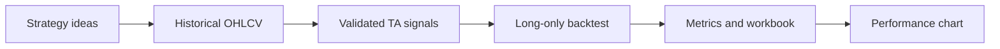

# Semantic Kernel Investment Workflow

[Repository overview](../README.md) &nbsp;|&nbsp; [Agent Framework](agent_framework.md) &nbsp;|&nbsp; **[Semantic Kernel workflow](semantic_kernel.md)** &nbsp;|&nbsp; [AutoGen reference](autogen.md) &nbsp;|&nbsp; [Agent Framework patterns](agent_framework_patterns.md) &nbsp;|&nbsp; [Framework comparison](autogen_agent_sk.md)

The [Semantic Kernel implementation](../semantic_kernel) is a variant of the [Agent Framework workflow](agent_framework.md). It follows the same research flow—strategy ideas, historical price retrieval, technical signals, long-only backtesting, metrics, and charts—but uses Semantic Kernel plugins instead of Foundry-backed agents.

It replaces implicit group-chat speaker selection with an explicit, testable workflow:



## Design

- [models.py](../semantic_kernel/models.py) defines the shared data contracts and strategy catalog.
- [tools.py](../semantic_kernel/tools.py) implements six native plugins: strategy ideas, optional Bing research, OHLCV data, deterministic signals, backtesting, and visualization.
- [workflow.py](../semantic_kernel/workflow.py) coordinates the plugins and stores independent artifacts per strategy.
- [main.py](../semantic_kernel/main.py) loads `.env` and supplies the shared `INVESTMENT_*` run settings.
- OHLCV stands for Open, High, Low, Close, and Volume

## Run

From the repository root:

```bash
uv run python -m semantic_kernel.main
```

Artifacts are written to [output/semantic_kernel](../output/semantic_kernel), with a subdirectory for each strategy. They intentionally use the same output layout as the Agent Framework workflow: a strategy catalog plus stock-data CSV, signal CSV, results spreadsheet, metrics text file, and performance chart for every strategy. The run prints this directory and requires internet access for the demonstration data adapter. Set `INVESTMENT_TICKER`, `INVESTMENT_START_DATE`, `INVESTMENT_END_DATE`, and `INVESTMENT_INITIAL_CAPITAL` in `.env` to configure it.

## AutoGen feature mapping

| AutoGen capability | Semantic Kernel implementation |
|---|---|
| Strategy-idea agent and JSON validation | `StrategyIdeasPlugin` creates and persists typed strategy specifications. |
| Stock-analysis agent | `StockDataPlugin` retrieves OHLCV data; `BacktestingPlugin` calculates results. |
| Signal-analysis agent plus code executor | `SignalGenerationPlugin` uses audited deterministic indicator implementations instead of executing LLM-generated Python. |
| Group-chat manager | `InvestmentWorkflow` provides a fixed, visible orchestration sequence. |
| Stock-report agent | `ReportingPlugin` exports the cumulative-return and drawdown figure. |
| Bing web search | `MarketResearchPlugin` offers an optional, key-gated Bing integration. |

## Safety and production requirements

The workflow is for research and backtesting only. It neither supplies personalized advice nor places orders. Before production use, substitute a licensed market-data source, validate corporate-action handling and execution assumptions, add transaction costs and slippage, enforce suitability/compliance controls, and require explicit human approval before any trading integration.
