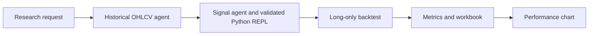

# Semantic Kernel Investment Workflow

[Repository overview](../README.md) &nbsp;|&nbsp; [Agent Framework](agent_framework.md) &nbsp;|&nbsp; **[Semantic Kernel workflow](semantic_kernel.md)** &nbsp;|&nbsp; [AutoGen reference](autogen.md) &nbsp;|&nbsp; [Agent Framework patterns](agent_framework_patterns.md) &nbsp;|&nbsp; [Framework comparison](autogen_agent_sk.md)

The [Semantic Kernel implementation](../semantic_kernel) is a plugin-based agent variant of the [Agent Framework workflow](agent_framework.md). It uses `ChatCompletionAgent` instances to fetch data, write and execute a signal script through a Python REPL plugin, backtest, plot, and summarize the result.

It uses an explicit, testable sequence while leaving the technical indicator choice and signal logic to the signal agent:



## Design

- [models.py](../semantic_kernel/models.py) defines the typed backtest metrics.
- [tools.py](../semantic_kernel/tools.py) implements native plugins for optional Bing research, OHLCV data, Python REPL execution, backtesting, and visualization.
- [research_repl.py](../semantic_kernel/research_repl.py) contains the Semantic Kernel-specific REPL implementation and its signal-file validation contract.
- [workflow.py](../semantic_kernel/workflow.py) configures Azure OpenAI `ChatCompletionAgent` instances and coordinates their tool use.
- [main.py](../semantic_kernel/main.py) loads `.env` and supplies the `INVESTMENT_*` research request.
- OHLCV stands for Open, High, Low, Close, and Volume

## Official Documentation

[Official Semantic Kernel documentation](https://learn.microsoft.com/semantic-kernel/overview/) &nbsp;|&nbsp; [Semantic Kernel GitHub repository](https://github.com/microsoft/semantic-kernel)

## Run

From the repository root:

```bash
uv run python -m semantic_kernel.main
```

The Semantic Kernel run reuses `AZURE_AI_PROJECT_ENDPOINT` and `AZURE_AI_MODEL_DEPLOYMENT_NAME` through Azure AI Inference by default. It can instead use `AZURE_OPENAI_ENDPOINT` and `AZURE_OPENAI_CHAT_DEPLOYMENT_NAME` when both are configured. Authenticate with `az login` for the default Entra ID flow. Artifacts are written to [output/semantic_kernel](../output/semantic_kernel): the auditable generated script, stock-data CSV, validated signal CSV, results spreadsheet, metrics text file, and performance chart. The run prints this directory and requires internet access for both the model and the demonstration data adapter. Set `INVESTMENT_TICKER`, `INVESTMENT_START_DATE`, `INVESTMENT_END_DATE`, and `INVESTMENT_INITIAL_CAPITAL` in `.env` to configure it.

## AutoGen feature mapping

| AutoGen capability | Semantic Kernel implementation |
|---|---|
| Strategy-idea agent and JSON validation | The signal agent decides its research hypothesis directly from the request. |
| Stock-analysis agent | `StockDataPlugin` retrieves OHLCV data; `BacktestingPlugin` calculates results. |
| Signal-analysis agent plus code executor | `PythonReplPlugin` executes and validates the signal agent's Python. |
| Group-chat manager | `InvestmentWorkflow` provides a visible sequence of tool-using `ChatCompletionAgent` instances. |
| Stock-report agent | `ReportingPlugin` exports the cumulative-return and drawdown figure. |
| Bing web search | `MarketResearchPlugin` offers an optional, key-gated Bing integration. |

## Safety and production requirements

The workflow is for research and backtesting only. It neither supplies personalized advice nor places orders. Its REPL is a development aid, not a security sandbox: run model-authored code only in an isolated environment without credentials or production data. Before production use, replace it with an approved sandbox, substitute a licensed market-data source, validate corporate-action handling and execution assumptions, add transaction costs and slippage, enforce suitability/compliance controls, and require explicit human approval before any trading integration.
